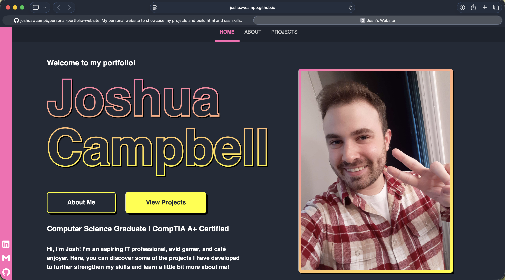
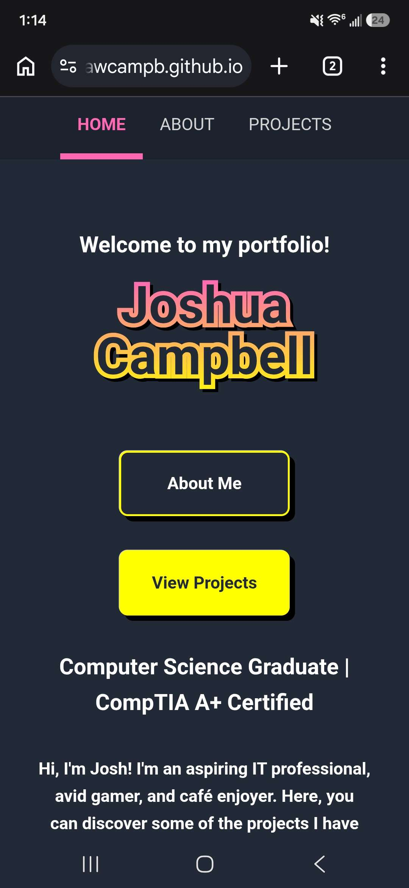

# Personal Portfolio Website



## Overview

A responsive personal portfolio website built with **HTML** and **CSS** to strengthen my front-end web development skills. This project focuses on creating a clean, professional, and mobile-friendly website while learning core web design principles and modern responsive layouts.

## Features

* Multi-page website
  
  * **Home** page
  * **About** page
  * **Projects** page
* Responsive design for desktop, tablet, and mobile devices
<details><summary>📸 Click here to view the mobile responsiveness!</summary></details>

* Clickable navigation and buttons
* Images throughout the site
* Transitions for hovering over buttons and images
* Clean and organized layout
* Mobile-friendly interface using responsive CSS

## What I Learned

This project gave me hands-on experience with many of the fundamentals of front-end web development, including:

* Structuring webpages with semantic HTML
* Styling layouts with CSS
* Working with typography, colors, spacing, and visual hierarchy
* Creating responsive designs using media queries
* Building flexible layouts that adapt to different screen sizes
* Organizing files and assets for a multi-page website
* Using images, links, and interactive buttons
* Improving consistency and usability across pages

## Technologies Used

* HTML5
* CSS3

## Project Structure

```text
├── index.html
├── about.html
├── projects.html
├── css/
├── images/
```

## Goals

The primary goal of this project was to build a complete personal website while developing a strong understanding of HTML and CSS. Rather than relying on templates or website builders, I created the site from scratch to gain practical experience with page layout, styling, responsiveness, and overall web design.

## Future Improvements

Potential enhancements include:

* Adding JavaScript for additional interactivity
* Optimizing images and overall site performance
* Improving responsiveness and flexibility with layouts
* Expanding the projects section as I complete more work
